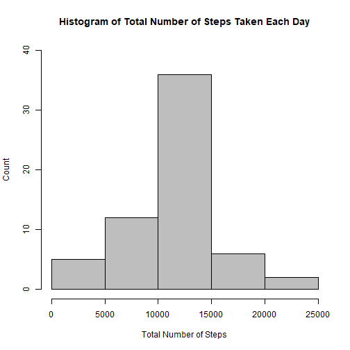

#Loading and preprocessing the data
###1. Load the data (i.e. read.csv())

```r
activity <- read.csv("activity.csv", 
                     header = TRUE, 
                     colClasses = c("numeric","Date","numeric"),
                     na.strings = "NA")
```
#What is mean total number of steps taken per day?
###1. Make a histogram of the total number of steps taken each day

```r
# Compute the total number of steps each day (NA values removed)
sum_data <- aggregate(activity$steps, by=list(activity$date), FUN=sum, na.rm=TRUE)

# Rename the attributes 
names(sum_data) <- c("date", "total")
```
We display the first few rows of the `sum_data` data frame:

```r
head(sum_data)
```

```
##         date total
## 1 2012-10-01     0
## 2 2012-10-02   126
## 3 2012-10-03 11352
## 4 2012-10-04 12116
## 5 2012-10-05 13294
## 6 2012-10-06 15420
```
The histogram is given by the following lines of code:

```r
hist(sum_data$total, 
     col='grey',
     xlab= 'Total Number of Steps',
     ylab='Count',
     ylim = c(0,30),
     main = 'Histogram of Total Number of Steps Taken Each Day'
     )
```


###2. Calculate and report the mean and median total number of steps taken per day
The mean and median are computed like

```r
options(scipen = 999) #remove scientific notation
mean<-round(mean(sum_data$total),0)
median<-round(median(sum_data$total),0)
```
These formulas gives a mean and median of 9354 and 10395 respectively.

#What is the average daily activity pattern?
###1.Make a time series plot (i.e. type = "l") of the 5-minute interval (x-axis) and the average number of steps taken, averaged across all days (y-axis)

```r
# Compute the means of steps accross all days for each interval
mean_data <- aggregate(activity$steps,
                       by=list(activity$interval),
                       FUN=mean,
                       na.rm=TRUE)
# Rename the attributes
names(mean_data) <- c("interval", "mean")
```
We display the first few rows of the `mean_data` data frame:

```r
head(mean_data)
```

```
##   interval      mean
## 1        0 1.7169811
## 2        5 0.3396226
## 3       10 0.1320755
## 4       15 0.1509434
## 5       20 0.0754717
## 6       25 2.0943396
```
The time serie plot is created by the following lines of code

```r
# Compute the time series plot
plot(mean_data$interval,
     mean_data$mean,
     type='l', 
     col='grey',
     lwd=2, 
     xlab="Interval [minutes]", 
     ylab="Average number of steps", 
     main="Time-series of the average number of steps per intervals\n(NA removed)"
     )
```


###2. Which 5-minute interval, on average across all the days in the dataset, contains the maximum number of steps?

```r
# We find the position of the maximum mean
max_pos <- which(mean_data$mean==max(mean_data$mean))

# We lookup the value of interval at this position
max_interval <- mean_data[max_pos,1]
```
The 5-minute interval that contains the maximum of steps, on average across all days, is 835.

#Imputing missing values
###1. Calculate and report the total number of missing values in the dataset (i.e. the total number of rows with NAs)

```r
NA_count <-sum(is.na(activity$steps))
```
The number of `NA`'s is 2304.

###2. Devise a strategy for filling in all of the missing values in the dataset. The strategy does not need to be sophisticated. For example, you could use the mean/median for that day, or the mean for that 5-minute interval, etc.

```r
# Find the NA positions
na_pos<-which(is.na(activity$steps))

# Create a vector of means
mean_vec <- rep(mean(activity$steps, na.rm=TRUE),times=length(na_pos))
```
We use the strategy to remplace each NA value by the mean of the steps attribute.

###3. Create a new dataset that is equal to the original dataset but with the missing data filled in.

```r
# Replace the NAs by the means
activityNew<-activity
activityNew[na_pos,"steps"]<-mean_vec
```
We display the first few rows of the new activity data frame:

```r
head(activityNew)
```

```
##     steps       date interval
## 1 37.3826 2012-10-01        0
## 2 37.3826 2012-10-01        5
## 3 37.3826 2012-10-01       10
## 4 37.3826 2012-10-01       15
## 5 37.3826 2012-10-01       20
## 6 37.3826 2012-10-01       25
```

###4. Make a histogram of the total number of steps taken each day and calculate and report the mean and median total number of steps taken per day. Do these values differ from the estimates from the first part of the assignment? What is the impact of imputing missing data on the estimates of the total daily number of steps?

```r
# Compute the total number of steps each day
sum_data <- aggregate(activityNew$steps, by=list(activityNew$date), FUN=sum)

# Rename the attributes
names(sum_data) <- c("date", "total")

# Compute the histogram of the total number of steps each day
hist(sum_data$total, 
     col='grey',
     xlab= 'Total Number of Steps',
     ylab='Count',
     ylim = c(0,40),
     main = 'Histogram of Total Number of Steps Taken Each Day'
     )
```



The mean and median are computed like

```r
options(scipen = 999) #remove scientific notation
mean<-round(mean(sum_data$total),0)
median<-round(median(sum_data$total),0)
```
These formulas gives a mean and median of 10766 and 10766 respectively.

These values differ greatly from the estimates from the first part of the assignment. The impact of imputing the missing values is to have more data, hence to obtain a bigger mean and median value.

#Are there differences in activity patterns between weekdays and weekends?
###1. Create a new factor variable in the dataset with two levels - "weekdays" and "weekend" indicating whether a given date is a weekday or weekend day.

```r
activityNew$daytype <- ifelse(weekdays(activityNew$date) %in% c("Saturday", "Sunday"),
                           "Weekend", "Weekday")
# The new factor variable 'daytype' was already in the activity data frame
head(activityNew)
```

```
##     steps       date interval daytype
## 1 37.3826 2012-10-01        0 Weekday
## 2 37.3826 2012-10-01        5 Weekday
## 3 37.3826 2012-10-01       10 Weekday
## 4 37.3826 2012-10-01       15 Weekday
## 5 37.3826 2012-10-01       20 Weekday
## 6 37.3826 2012-10-01       25 Weekday
```

###2. Make a panel plot containing a time series plot (i.e. type = "l") of the 5- minute interval (x-axis) and the average number of steps taken, averaged across all weekday days or weekend days (y-axis).


```r
# Load the lattice graphical library
library(lattice)

# Compute the average number of steps taken, averaged across all daytype variable
mean_data <- aggregate(activityNew$steps, 
                       by=list(activityNew$daytype, 
                               activityNew$interval), mean)
# Rename the attributes
names(mean_data) <- c("daytype", "interval", "mean")
```

We display the first few rows of the `mean_data` data frame: 

```r
head(mean_data)
```

```
##   daytype interval     mean
## 1 Weekday        0 7.006569
## 2 Weekend        0 4.672825
## 3 Weekday        5 5.384347
## 4 Weekend        5 4.672825
## 5 Weekday       10 5.139902
## 6 Weekend       10 4.672825
```

The time series plot take the following form:

```r
xyplot(mean ~ interval | daytype, mean_data, 
       type="l", 
       lwd=1, 
       xlab="Interval", 
       ylab="Number of steps", 
       layout=c(1,2))
```


Yes, the step activity trends are different based on whether the day occurs on a weekend or not. This may be due to people having an increased opportunity for activity beyond normal work hours for those who work during the week.
